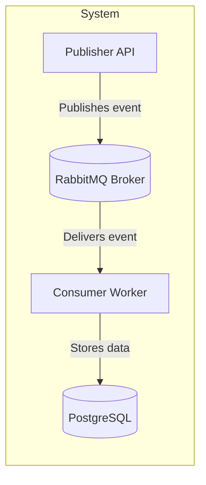

# Subscription System

Welcome to the Subscription microservices system documentation.

This project is composed of four main components:

- **Core**: Domain and shared logic.
- **Publisher**: API that receives subscription requests and publishes events to RabbitMQ.
- **Consumer**: Background service that listens to events from RabbitMQ and persists data.
- **Infrastructure**: Integrations like database, messaging, and repositories.

## 📊 Architecture Overview




# API Reference

This section contains the technical reference for each module in the Subscription project.

You will find public classes, methods, and interfaces extracted directly from the source code XML documentation.

## 📦 Modules

- Subscription.Core
- Subscription.Publisher
- Subscription.Consumer
- Subscription.Infrastructure

## 🔄 Component Interaction

```mermaid
flowchart TB
  API[Publisher API] -->|Event| MQ[🐇 RabbitMQ]
  MQ -->|Message| Worker[Consumer Worker]
  Worker -->|Write| DB[(PostgreSQL)]
